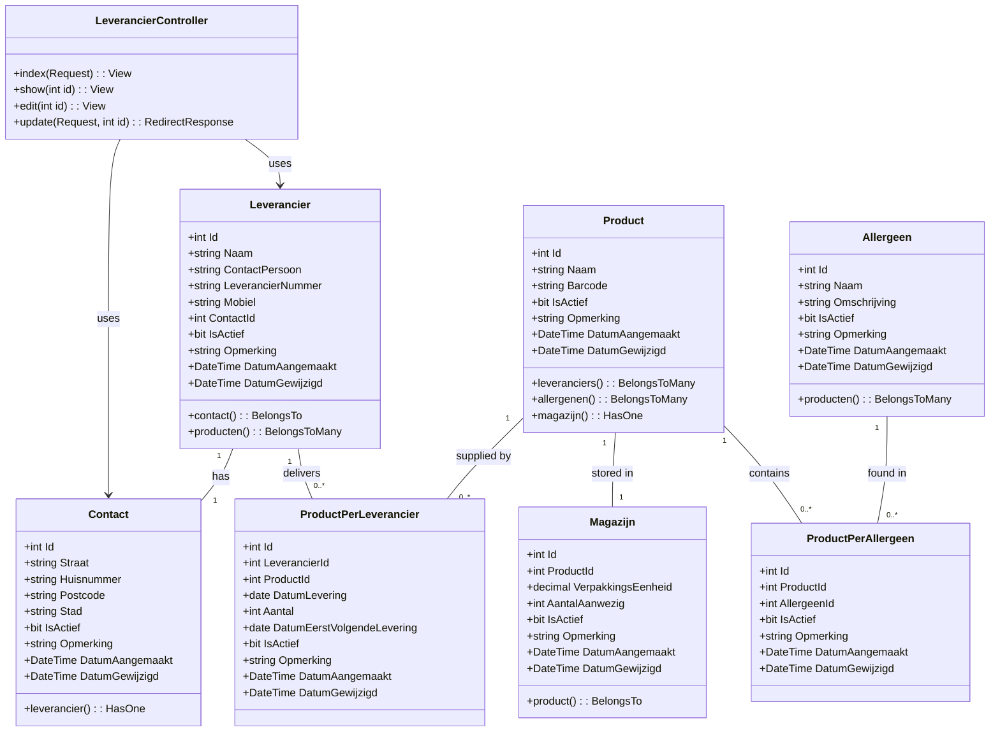
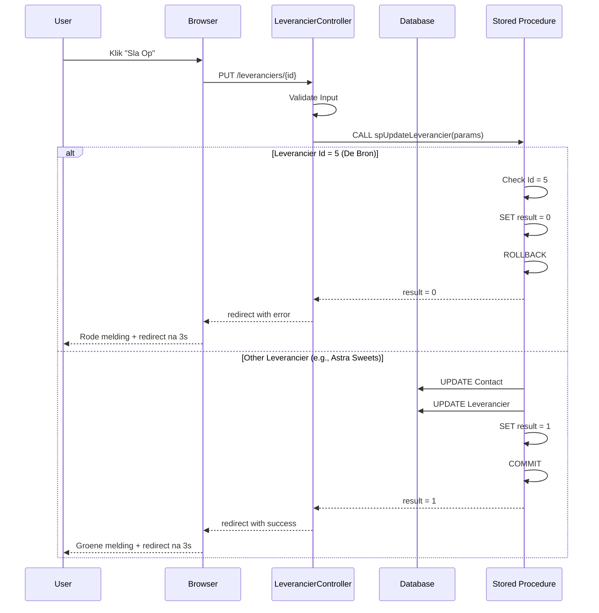

# Class Diagram - Jamin Leveranciers Management



## Beschrijving van Classes

### LeverancierController
**Verantwoordelijkheid:** Afhandelen van HTTP requests voor leverancier management

**Belangrijkste methoden:**
- `index()`: Toont overzicht van leveranciers met pagination (max 4 records)
- `show()`: Toont details van specifieke leverancier
- `edit()`: Toont formulier voor wijzigen leverancier
- `update()`: Verwerkt wijzigingen en roept stored procedure aan

**Design Patterns:**
- MVC (Model-View-Controller)
- Dependency Injection (via Laravel's service container)

### Model Classes
Alle model classes erven van `Illuminate\Database\Eloquent\Model` en implementeren:
- Active Record pattern voor database interacties
- Relationships (BelongsTo, HasOne, BelongsToMany)
- Mass assignment protection via `$fillable`
- Timestamps beheer via custom fields

### Relaties

**1:1 Relaties:**
- Leverancier heeft één Contact
- Product heeft één Magazijn record

**1:N Relaties:**
- Product heeft meerdere Magazijn entries (historisch)
- Contact kan bij meerdere leveranciers horen (in theorie)

**N:M Relaties:**
- Leverancier levert meerdere Producten (via ProductPerLeverancier)
- Product bevat meerdere Allergenen (via ProductPerAllergeen)

## Stored Procedures (Database Layer)

```
spGetAllLeveranciers(limit, offset) → ResultSet
spCountLeveranciers() → int
spGetLeverancierById(id) → Leverancier
spUpdateLeverancier(params...) → OUT int result
spGetProductsByLeverancier(id) → ResultSet
```

## Sequence Diagram - Update Scenario



## Class Responsibilities

| Class | Verantwoordelijkheid | Layer |
|-------|---------------------|-------|
| LeverancierController | HTTP request handling, routing, view rendering | Presentation |
| Leverancier Model | Data representation, business logic, relationships | Domain |
| Contact Model | Address data management | Domain |
| Product Model | Product data management | Domain |
| Allergeen Model | Allergen information | Domain |
| Magazijn Model | Inventory tracking | Domain |
| Stored Procedures | Data persistence, transaction management, business rules | Data Access |

## SOLID Principles Applied

**Single Responsibility Principle (SRP):**
- Elke model class heeft één verantwoordelijkheid
- Controller heeft alleen routing verantwoordelijkheid
- Stored procedures isoleren database logic

**Open/Closed Principle (OCP):**
- Models zijn open voor extensie via Eloquent relationships
- Gesloten voor modificatie door gebruik van protected properties

**Liskov Substitution Principle (LSP):**
- Alle models kunnen worden vervangen door hun parent Model class
- Interface consistency via Eloquent

**Interface Segregation Principle (ISP):**
- Models implementeren alleen de methods die ze nodig hebben
- Geen forced implementation van ongebruikte methods

**Dependency Inversion Principle (DIP):**
- Controller depends op abstractions (Eloquent Model) niet op concrete implementations
- Database access via Laravel's Query Builder/PDO abstraction

## Testing Strategy

**Unit Tests:**
- Test model creation
- Test model relationships
- Test data validation

**Integration Tests:**
- Test stored procedure calls
- Test transaction rollbacks
- Test pagination logic

**Feature Tests:**
- Test complete user flows
- Test scenario 01 (success)
- Test scenario 02 (failure)
